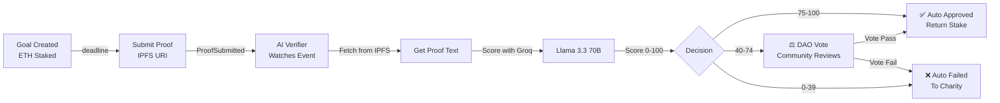

# TimeVault Goals — Stakes & Accountability

A decentralized platform where users stake crypto to achieve their goals, with AI-powered verification and community voting.

---

## 📋 Quick Start

### Prerequisites
- Node.js 18+
- Foundry (`foundryup`)
- Bun or npm

### Clone & Setup

```bash
cd timevault-goals

# Install all dependencies
npm install  # or bun install

# Set up environments
cp contracts/.env.example contracts/.env
cp backend/.env.example backend/.env
cp frontend/.env.example frontend/.env.local
```

---

## 📦 Project Structure

```
timevault-goals/
├── contracts/          ← Solidity smart contracts (Foundry)
├── backend/            ← AI Verifier service (Node/TypeScript)
└── frontend/           ← Next.js 14 application
```

---

## 🔧 Development Setup

### 1. **Contracts** (Foundry)

```bash
cd contracts

# Install dependencies
forge install

# Run tests
forge test

# Deploy to Monad testnet
forge script script/Deploy.s.sol --rpc-url https://testnet-rpc.monad.xyz --broadcast
```

**Key Files:**
- [contracts/src/StakeYourGoal.sol](contracts/src/StakeYourGoal.sol) — Main goal contract
- [contracts/src/GoalBadgeNFT.sol](contracts/src/GoalBadgeNFT.sol) — Soulbound badges
- [contracts/test/StakeYourGoal.t.sol](contracts/test/StakeYourGoal.t.sol) — Fuzz tests

---

### 2. **Backend** (Node/TypeScript)

```bash
cd backend

# Install packages
npm install

# Copy environment variables
cp .env.example .env

# Start the verifier service
npm run dev
```

**Key Files:**
- [backend/verifier.ts](backend/verifier.ts) — Main event listener
- [backend/groq.ts](backend/groq.ts) — Llama 3.3 AI scoring
- [backend/chain.ts](backend/chain.ts) — viem client for Monad

**Environment Variables:**
```env
GROQ_API_KEY=gsk_xxxxxxxxxxxx  # Get from console.groq.com
RPC_URL=https://testnet-rpc.monad.xyz
PRIVATE_KEY=0x...             # Verifier wallet
CONTRACT_ADDRESS=0x...        # Deployed StakeYourGoal
```

---

### 3. **Frontend** (Next.js)

```bash
cd frontend

# Install packages
npm install

# Start dev server
npm run dev
```

Open [http://localhost:3000](http://localhost:3000)

**Key Files:**
- [frontend/app/page.tsx](frontend/app/page.tsx) — Landing page
- [frontend/app/dashboard/page.tsx](frontend/app/dashboard/page.tsx) — User dashboard
- [frontend/app/create/page.tsx](frontend/app/create/page.tsx) — Goal creation wizard
- [frontend/lib/wagmi.ts](frontend/lib/wagmi.ts) — Wagmi + RainbowKit config
- [frontend/lib/contract.ts](frontend/lib/contract.ts) — Contract ABI & addresses

**Environment Variables:**
```env
NEXT_PUBLIC_WALLET_CONNECT_ID=...
NEXT_PUBLIC_STAKE_CONTRACT_ADDRESS=0x...
NEXT_PUBLIC_BADGE_CONTRACT_ADDRESS=0x...
```

---

## 🤖 AI Verification Flow



---

## 📊 Key Features

### ✅ Smart Contracts
- **Goal Creation** — Stake ETH with deadline
- **Proof Submission** — Upload to IPFS, trigger verification
- **AI Scoring** — Automatic scoring (0-100)
- **Voting** — DAO reviews borderline cases (40-74)
- **Soulbound Badges** — NFT achievements

### 🤖 AI Verifier
- **Real-time Event Listening** — Watches ProofSubmitted events
- **IPFS Fetching** — Retrieves proof content
- **Llama 3.3 Scoring** — Uses Groq's free API (14,400 req/day)
- **On-chain Submission** — Posts scores back to contract

### 🎨 Frontend
- **Landing & Onboarding** — Marketing site
- **Dashboard** — User goals, stats, achievements
- **Creator Wizard** — 3-step goal setup
- **Proof Submission** — Form + file upload
- **DAO Panel** — Vote on disputed goals
- **Analytics** — Charts & insights

---

## 🚀 Deployment

### Mainnet Contracts
```bash
cd contracts
PRIVATE_KEY=0x... forge script script/Deploy.s.sol \
  --rpc-url https://testnet-rpc.monad.xyz \
  --broadcast \
  --verify
```

### Backend (Railway/Heroku)
```bash
cd backend
npm run build
npm start
```

### Frontend (Vercel)
```bash
cd frontend
vercel deploy
```

---

## 🔐 Security

- ✅ Solidity contracts use OpenZeppelin (ERC-721, ReentrancyGuard)
- ✅ Fuzz tested with Foundry
- ✅ Strict type checking (TypeScript)
- ✅ Environment variables never committed
- ✅ AI model runs locally on backend (no user data to 3rd parties)

---

## 💡 How It Works

1. **User stakes ETH** on a goal with deadline
2. **AI verifier listens** for proof submissions
3. **Groq + Llama scores** the proof automatically
4. **Results posted on-chain**:
   - Score ≥75: Auto-approved, stake returned
   - 40-74: DAO votes
   - <40: Auto-failed, charity receives stake

---

## 🛠️ Tech Stack

| Layer | Tech |
|-------|------|
| **Smart Contracts** | Solidity, OpenZeppelin, Foundry |
| **AI** | Groq API, Llama 3.3 70B |
| **Backend** | TypeScript, viem, ts-node |
| **Frontend** | Next.js 14, React, Tailwind, Wagmi |
| **Blockchain** | Monad Testnet, ERC-721 |

---

## 📝 License

MIT

---

## 🤝 Contributing

Pull requests welcome! Please:
1. Create feature branch (`git checkout -b feature/amazing-feature`)
2. Commit changes (`git commit -m 'Add feature'`)
3. Push to branch (`git push origin feature/amazing-feature`)
4. Open Pull Request

---

## 📧 Support

- Docs: See individual README files in each folder
- Issues: GitHub Issues
- Discord: [Coming soon]

---

**Built with ❤️ for Monad Testnet**
